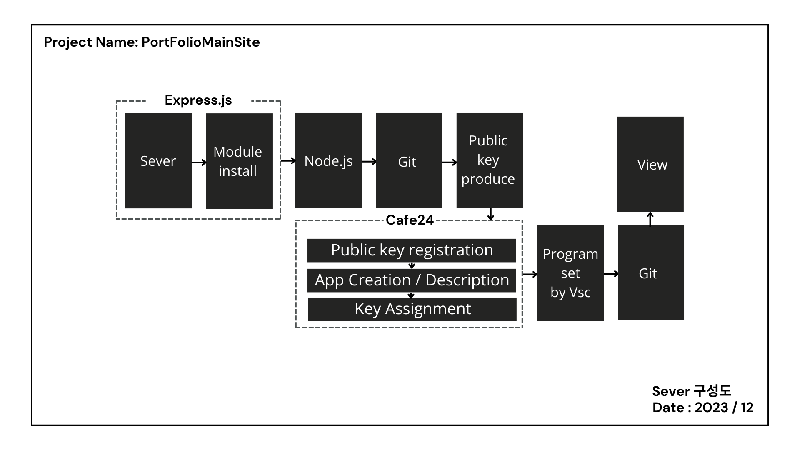
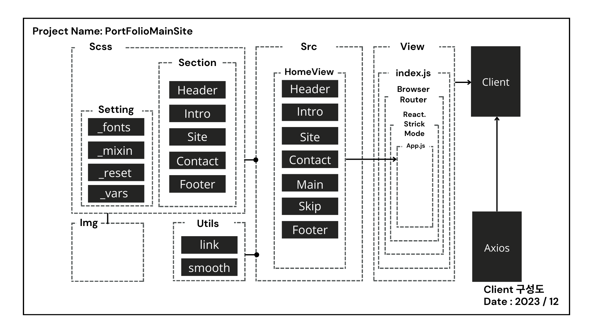
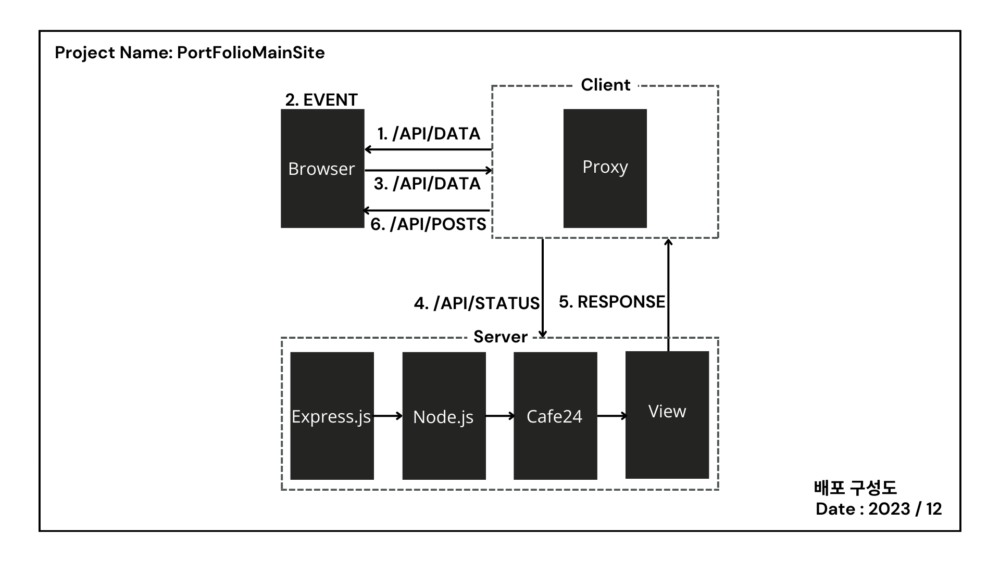

# 프로젝트 명

- 포트폴리오 메인 사이트

## 프로젝트 개요

### 결론

**Express.js를 이용하여 proxy를 사용하여 React와 API 서버 간의 인터페이스를 형성하고 배포하려고 했지만**  
**문제점을 파악하고 국비 강사님에게 도움을 요청하여 사이트를 구축했습니다. 이로 인해, 원활한 협업을 위해 코드 충돌을 방지하고 충돌이 발생한 코드 영역을 식별하며, 내용을 비교하여 해결 방법을 모색하고, 테스트와 배포 절차를 습득할 수 있었습니다.**

### 나의 계획

- Server단(express)과 Client단(react.js)으로 사이트 구성
- proxy로 클라이언트와 API 서버 간의 인터페이스 형성
- axios로 요청, 응답 처리
- eslint, prettier를 이용하여 버그를 분석하여 해결하고 질 좋은 코드를 작성
- node.js 형식으로 cafe24 호스팅 배포  
  **React에서 CSR을 개발할 때는 일반적으로 외부 API 서버와의 연동을 통해 데이터를 주고받으며 구축한다는 것을 알게 되었습니다.**

## 기술 스택

### Server

#### 구성도

  

- express는 Node.js 기반의 웹 프레임워크로, 웹 애플리케이션 및 API를 개발하기 위해 사용됩니다.
- nodemon는 개발 시 자동 재시작을 제공하는 도구입니다.
- concurrently는 서버와 클라이언트를 동시에 실행할 수 있도록 도와줍니다.
- proxy는 CORS 에러를 해결하여 클라이언트에 보다 안정적인 인터페이스를 제공할 수 있습니다.
- http-proxy-middleware는 HTTP 요청을 프록시 서버로 전달하고 응답을 받을 수 있습니다.

* 학습 : CORS는 왜 발생 하는가?  
  ` 요청을 보내는 클라이언트 서버와 요청을 받는 서버의 도메인이 다를 때 생기는 문제`

### Client

#### 구성도

  

- HTML, CSS 기반으로 웹사이트의 기본 레이아웃 설계하고, 웹 표준 및 웹 접근성을 준수하여 작업합니다.
- react를 사용하여 사이트를 번들링하고 관리합니다.
- gsap를 이용하여 패럴랙스 효과를 줍니다.
- lenis를 이용하여 smooth 효과를 구현합니다.
- http-proxy-middleware를 이용하여 효율적이고 유지보수를 향상시킵니다.
- axios를 이용하여 클라이언트와 서버 간에 HTTP 요청을 보내고 응답을 받습니다.
- cafe24를 통해 사이트를 배포합니다.
- git을 사용하여 파일을 관리합니다.

### eslint-config-prettier

- eslint, prettier를 설치하여 코드분석의 편의성을 높입니다.
- eslint-config-prettier를 설치하여 rule이 겹치는 충돌을 막습니다.

## 프로젝트 실행

### 배포 구성도

  

### (중요) 초기설정

- 카페24 배포 git 초기설정 (node.js 호스팅)

* key를 생성합니다. (C:\Users\username\.ssh)  
  `ssh-keygen -t rsa -C "키 명칭`
* id_rsa.pub를 열고 카페24에 키를 등록합니다.
* 앱 생성하고 key 할당으로 앱에 키를 등록합니다.
* git remote 순서 client -> server -> cafe24 -> port2023-mainsite
* git 최상위 폴더에 하위폴더에 화살표 표시가 날 경우 -> 이유: 해당폴더에 .git 폴더가 생겨서 문제 발생  
  `해결: .git 파일제거 -> 스테이지 파일 제거 -> add, commit, push 진행`
* 문제가 발생하는 디렉토리에서 .git 파일제거  
  순서 (조회:ls -al -> 해당 파일 제거: rm -rf .git -> 확인: ls -al)
  `ls -al`  
   `rm -rf .git`  
   `ls -al`
* 스테이지에 존재하는 파일 제거  
  순서 (git rm --cached . -rf -> git status)  
  `git rm --cached . -rf`  
  `git status`
* add, comit, push 진행
* git 초기 설정  
  `git init`  
  `git add .`  
  `git commit -m ""`
* 카페 24 연결 (저장소 이름 확인 git은 제외하고 복사)  
  `git remote add cafe24 user@user01.cafe24app.com:user_user01`  
  `git push cafe24 master`

### Server

- express, nodemon, concurrently를 설치합니다.  
  `$ npm install nodemon concurrently`
- http-proxy-middleware를 설치합니다.  
  `npm install --save http-proxy-middleware `

### Client

- react-router-dom, sass, gsap, lenis를 설치합니다.  
  `npm install react-router-dom sass gsap @studio-freight/lenis`
- axios를 설치합니다.  
  `npm install axios`
- http-proxy-middleware를 설치합니다.  
  `npm install --save-dev http-proxy-middleware`

### prettier, eslint

- pretteier를 설치합니다.  
  `npm install prettier --save-dev`
- eslint를 설치합니다.  
  `npm install eslint --save-dev`
- eslint-config-prettier를 설치합니다.  
  `npm install eslint-config-prettier --save-dev`
- node_modules > eslint-plugin-jsx-ally > .eslintrc에 코드를 추가합니다.  
   `{
  "plugins": [
  "jsx-ally"
],
"rules": {
  "jsx-a11y/rule-name": 2,
  "react/prop-types": "off",
  "no-var": "error",
  "no-multiple-empty-lines": "error",
  "no-console": "off",
  "eqeqeq": "error",
  "dot-notation": "error",
  "no-unused-vars": "error"
},
"extends": [
  "react-app",
  "eslint:recommended",
  "prettier",
  "airbnb-base",
  "plugin:jsx-a11y/recommended"
]
}`

- Client 디렉토리 > .eslintrc.cjs에 .eslintr 에 있는 rules를 추가합니다.
